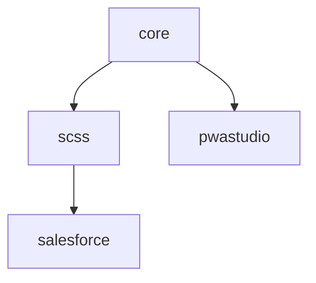

# stylelint config
[![Tests][tests-badge]][tests-url]
[![Lerna][lerna-badge]][lerna-url]

> Opinionated stylelint [extendable config](https://stylelint.io/user-guide/configuration/#extends).


## Rulesets

| Package | Version | Description | Documentation |
|---|---|---|---|
| **[@valtech-commerce/stylelint-config-core](packages/core)** | [](https://www.npmjs.com/package/@valtech-commerce/stylelint-config-core) | **Core rules** | [docs](https://valtech-commerce.github.io/stylelint-config/core) |
| [@valtech-commerce/stylelint-config-scss](packages/scss) | [](https://www.npmjs.com/package/@valtech-commerce/stylelint-config-scss) | SCSS | [docs](https://valtech-commerce.github.io/stylelint-config/scss) |
| [@valtech-commerce/stylelint-config-salesforce](packages/salesforce) | [](https://www.npmjs.com/package/@valtech-commerce/stylelint-config-salesforce) | Salesforce | [docs](https://valtech-commerce.github.io/stylelint-config/salesforce) |
| [@valtech-commerce/stylelint-config-pwastudio](packages/pwastudio) | [](https://www.npmjs.com/package/@valtech-commerce/stylelint-config-pwastudio) | PWA Studio | [docs](https://valtech-commerce.github.io/stylelint-config/pwastudio) |

### Dependency tree


## Install

```
$ npm install @valtech-commerce/stylelint-config-[RULESET]
```


## Usage

Add some stylelint config to your `.stylelintrc.yaml`:

```yaml
extends: '@valtech-commerce/stylelint-config-[RULESET]'
```


## Used plugins

- [stylelint-declaration-strict-value](https://github.com/AndyOGo/stylelint-declaration-strict-value) - Enforces variables, functions, keywords for property's values
- [stylelint-order](https://github.com/hudochenkov/stylelint-order) - Order related linting rules


## Documentation

See the [full documentation](https://valtech-commerce.github.io/stylelint-config/core) for an in-depth look.

See the [Changelog](CHANGELOG.md) to see what has changed.


## Contribute

See the [Contributing Guidelines](CONTRIBUTING.md) for ways to get started.

See the [Support Guide](SUPPORT.md) for ways to get help.

See the [Security Policy](SECURITY.md) for sharing vulnerability reports.

This project has a [Code of Conduct](CODE_OF_CONDUCT.md).
By interacting with this repository, organization, or community you agree to abide by its terms.


## License

[MIT](LICENSE) © [Valtech Canada inc.](https://www.valtech.ca/)


[tests-badge]: https://github.com/valtech-commerce/stylelint-config/workflows/tests/badge.svg?branch=main
[lerna-badge]: https://img.shields.io/badge/maintained%20with-lerna-cc00ff.svg

[tests-url]: https://github.com/valtech-commerce/stylelint-config/actions?query=workflow%3Atests+branch%3Amain
[lerna-url]: https://lerna.js.org/
