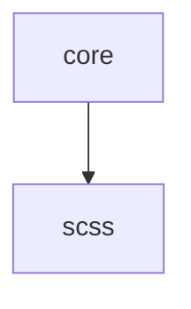

# stylelint config

[![npm][npm-badge]][npm-url]
[![npms.io: Score][npmsio-badge]][npmsio-url]
[![libraries.io: SourceRank][librariesio-badge]][librariesio-url]
[![Tests][tests-badge]][tests-url]
[![License: MIT][license-badge]][license-url]

> Opinionated stylelint [extendable config](https://stylelint.io/user-guide/configuration/#extends).

## Rulesets

| Ruleset                                 | Description    |
| --------------------------------------- | -------------- |
| **[core](extendable-config/core.yaml)** | **Core rules** |
| [scss](extendable-config/scss.yaml)     | SCSS rules     |

### Dependency tree



## Install

```
$ npm install @valtech-commerce/stylelint-config
```

## Usage

Add some stylelint config to your `.stylelintrc.yaml`:

```yaml
extends: "@valtech-commerce/stylelint-config/[RULESET]"
```

## Specifications

### `core`

#### Used plugins

- [stylelint-declaration-strict-value](https://github.com/AndyOGo/stylelint-declaration-strict-value) - Enforces variables, functions, keywords for property's values
- [stylelint-order](https://github.com/hudochenkov/stylelint-order) - Order related linting rules

### `scss`

#### Used plugins

- [stylelint-scss](https://github.com/kristerkari/stylelint-scss) - SCSS specific linting rules

## Documentation

See the [Changelog](CHANGELOG.md) to see what has changed.

## Contribute

See the [Contributing Guidelines](CONTRIBUTING.md) for ways to get started.

See the [Support Guide](SUPPORT.md) for ways to get help.

See the [Security Policy](SECURITY.md) for sharing vulnerability reports.

This project has a [Code of Conduct](CODE_OF_CONDUCT.md).
By interacting with this repository, organization, or community you agree to abide by its terms.

## License

[MIT](LICENSE) © [Valtech Canada inc.](https://www.valtech.ca/)

[npm-badge]: https://img.shields.io/npm/v/@valtech-commerce/stylelint-config?style=flat-square
[npmsio-badge]: https://img.shields.io/npms-io/final-score/@valtech-commerce/stylelint-config?style=flat-square
[librariesio-badge]: https://img.shields.io/librariesio/sourcerank/npm/@valtech-commerce/stylelint-config?style=flat-square
[tests-badge]: https://img.shields.io/github/actions/workflow/status/valtech-commerce/stylelint-config/tests.yaml?style=flat-square&branch=main
[license-badge]: https://img.shields.io/badge/license-MIT-green?style=flat-square
[npm-url]: https://www.npmjs.com/package/@valtech-commerce/stylelint-config
[npmsio-url]: https://npms.io/search?q=%40valtech-commerce%2Fstylelint-config
[librariesio-url]: https://libraries.io/npm/@valtech-commerce%2Fstylelint-config
[tests-url]: https://github.com/valtech-commerce/stylelint-config/actions/workflows/tests.yaml?query=branch%3Amain
[license-url]: https://opensource.org/licenses/MIT
